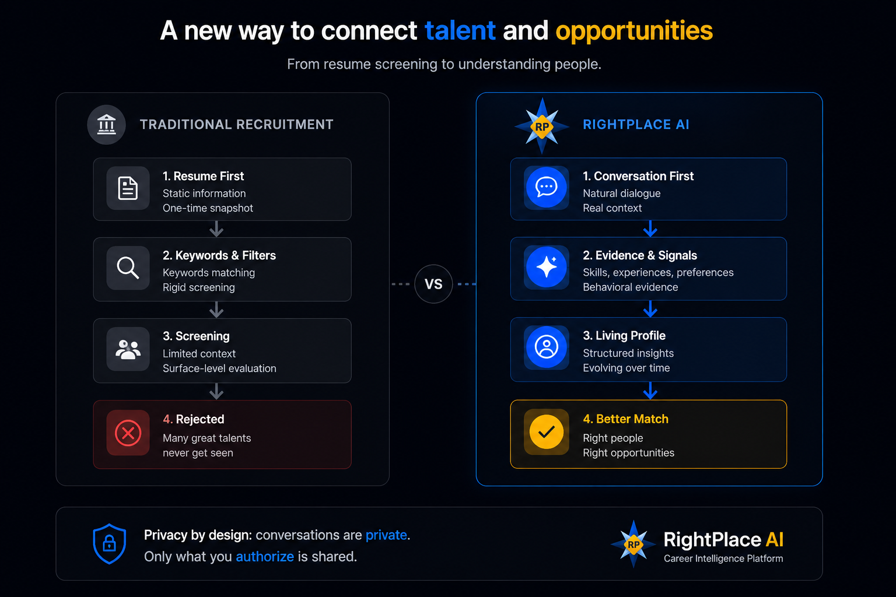
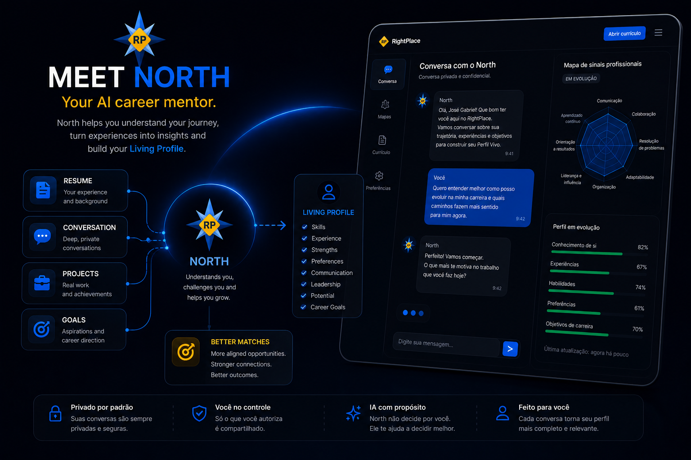
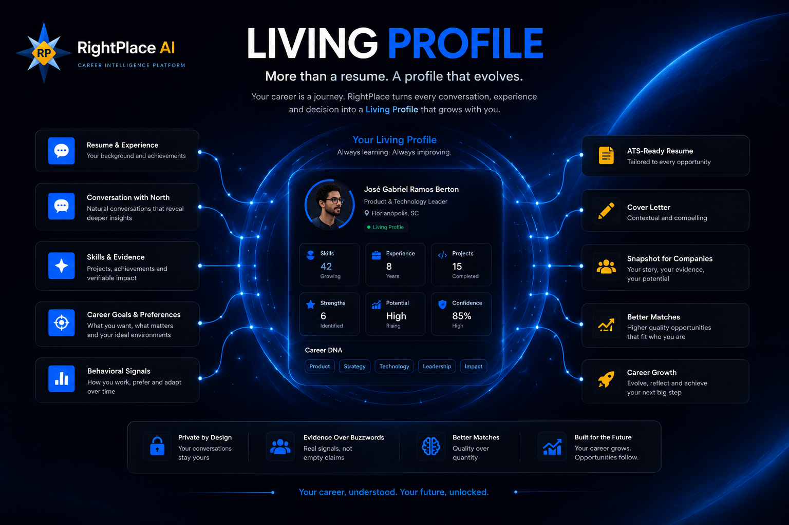
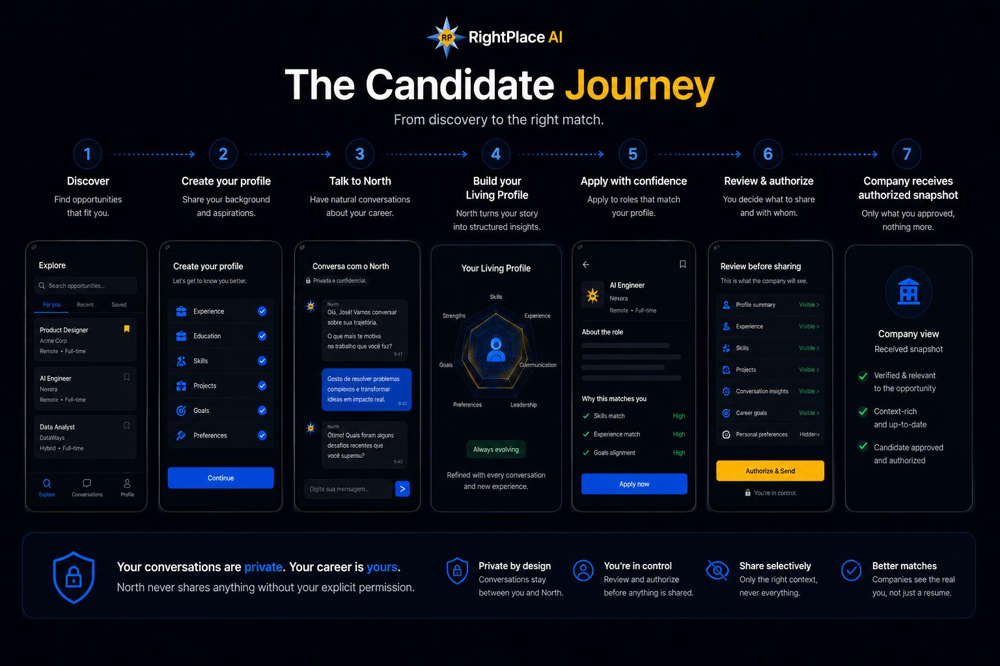
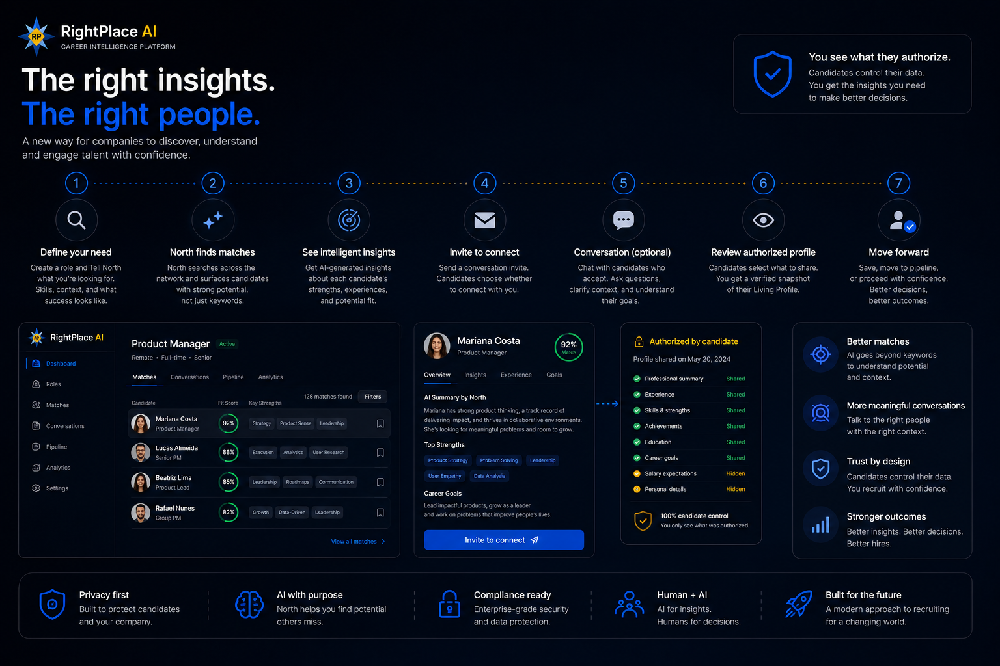
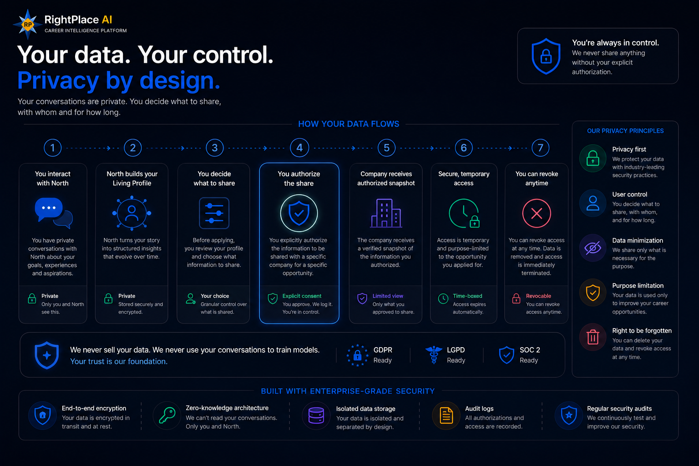
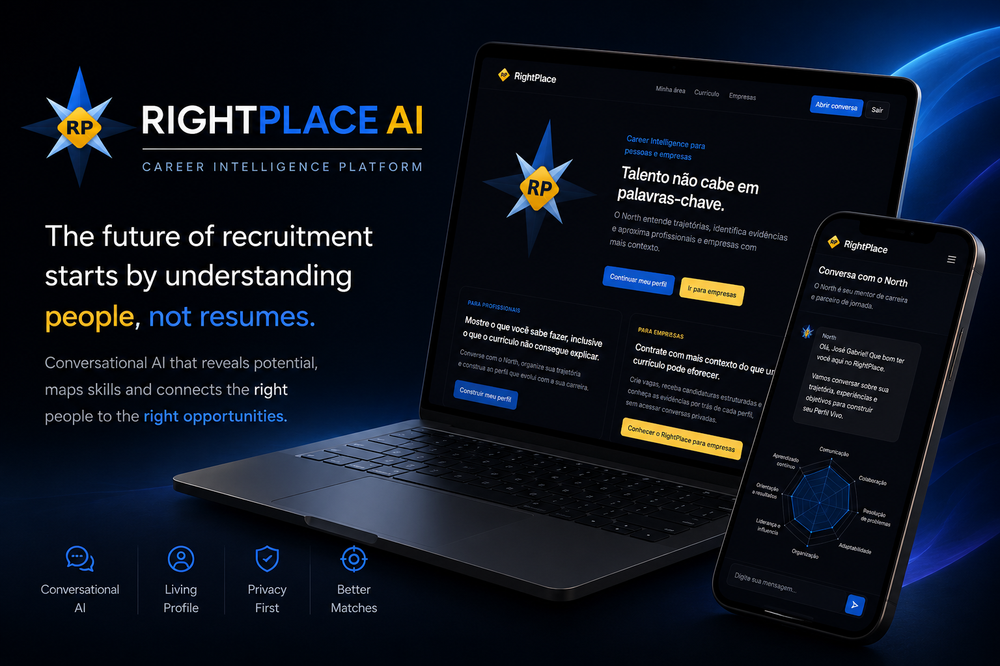
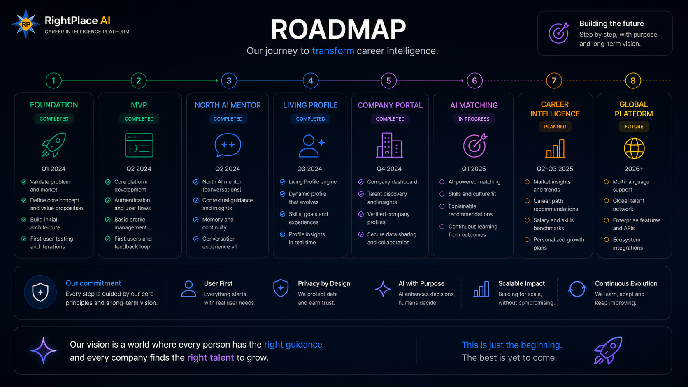

<h1 align="center">RightPlace AI</h1>

<p align="center">
<strong>Career Intelligence Platform</strong><br>
Designing a conversation-first approach to hiring.
</p>

<p align="center">
⭐ Product Engineering Case Study • 🧠 Conversational AI • 👤 Living Profiles • ☁️ Cloud Native • 🔒 Privacy by Design
</p>

<p align="center">
<em>Understanding people before matching opportunities.</em>
</p>

> [!TIP]
>
> This repository documents the complete product journey behind RightPlace AI — from discovery and UX decisions to conversational AI, cloud architecture and engineering principles.

---

# The Future of Hiring Starts Here

<table align="center">
<tr>
<td width="45%" valign="top">

### Traditional Hiring

- 📄 Resume-first
- 🔍 Keyword matching
- 📑 Static documents
- 🔁 One application
- 🕰️ Past experience

</td>

<td width="10%"></td>

<td width="45%" valign="top">

### RightPlace AI

- 💬 Conversation-first
- 🧠 Context understanding
- 👤 Living Profiles
- ♾️ Continuous evolution
- 🚀 Future potential

</td>
</tr>
</table>

---

<h2 align="center">At a Glance</h2>

<table align="center">
<tr>
<td align="center" width="33%">

### 🎯 Purpose

Career Intelligence Platform

</td>

<td align="center" width="33%">

### 🤖 AI

North Conversational Intelligence

</td>

<td align="center" width="33%">

### 👤 Core Concept

Living Profiles

</td>
</tr>

<tr>
<td align="center">

### ☁️ Architecture

Cloud Native

</td>

<td align="center">

### 🔒 Privacy

Privacy by Design

</td>

<td align="center">

### 🧩 Status

MVP in Active Development

</td>
</tr>
</table>

## The Problem

> **Modern hiring became incredibly efficient.**
>
> **Unfortunately, it also became increasingly superficial.**

Traditional recruitment was designed around documents.

Today, resumes are optimized for algorithms, not for understanding people.

While companies save time filtering thousands of applications, valuable professional context is often lost.

<h3 align="center">What gets lost?</h3>

<table align="center">
<tr>
<th align="center">Challenge</th>
<th align="center">Impact</th>
</tr>

<tr>
<td align="center">📄 Static resumes</td>
<td align="center">Professionals become PDFs instead of people.</td>
</tr>

<tr>
<td align="center">🔍 Keyword matching</td>
<td align="center">Human context disappears behind algorithms.</td>
</tr>

<tr>
<td align="center">🔁 Repetitive applications</td>
<td align="center">Candidates restart their story for every opportunity.</td>
</tr>

<tr>
<td align="center">🤝 Limited understanding</td>
<td align="center">Potential, motivation and adaptability are overlooked.</td>
</tr>

</table>

Rather than understanding professionals, modern hiring often evaluates documents.

RightPlace AI was created to challenge that assumption.

---

## A Better Approach

> **Understanding should come before matching.**

<p align="center">
  
</p>

<p align="center">
  <em>Traditional recruitment evaluates resumes. RightPlace AI understands people.</em>
</p>

Traditional hiring asks candidates to repeatedly adapt their resumes for every opportunity.

RightPlace AI takes a different approach.

Instead of collecting documents, it builds understanding.

Instead of static forms, candidates have meaningful conversations with North.

Instead of isolated keywords, the platform identifies context, potential and career direction.

<h3 align="center">What changes?</h3>

<table align="center">
<tr>
<th align="center">Traditional Hiring</th>
<th align="center">RightPlace AI</th>
</tr>

<tr>
<td align="center">📄 Static resumes</td>
<td align="center">👤 Living Profiles</td>
</tr>

<tr>
<td align="center">🔍 Keyword matching</td>
<td align="center">🧠 Context understanding</td>
</tr>

<tr>
<td align="center">📑 Previous experience</td>
<td align="center">🚀 Growth potential</td>
</tr>

<tr>
<td align="center">📝 Forms and applications</td>
<td align="center">💬 Natural conversations</td>
</tr>

</table>

The result is a hiring experience where Artificial Intelligence supports better human decisions instead of replacing them.

## Our Design Principles

These principles guide every product and engineering decision behind RightPlace AI.

| Principle | Description |
|:---------:|-------------|
| 👤 **People First** | Careers evolve. Professional profiles should evolve too. |
| 💬 **Conversation Before Evaluation** | Understanding always comes before matching. |
| 🤖 **AI as an Assistant** | AI supports people instead of replacing them. |
| 🔒 **Privacy by Design** | Trust is built into the platform from day one. |

---

## Meet North

<p align="center">
  
</p>

> [!NOTE]
>
> **North isn't an AI recruiter.**
>
> North isn't an ATS.
>
> North isn't an interviewer.
>
> North exists for one purpose:
>
> **Understand professionals before connecting them with opportunities.**

North is the conversational intelligence behind RightPlace AI.

Instead of collecting forms and resumes, North builds professional understanding through natural conversations.

Every interaction uncovers experiences that are rarely captured by traditional hiring processes.

<h3 align="center">North helps uncover</h3>

<table align="center">
<tr>
<th align="center">What North discovers</th>
<th align="center">Why it matters</th>
</tr>

<tr>
<td align="center">🚀 Career transitions</td>
<td align="center">Reveal adaptability and resilience.</td>
</tr>

<tr>
<td align="center">💡 Personal projects</td>
<td align="center">Demonstrate initiative and curiosity.</td>
</tr>

<tr>
<td align="center">📚 Continuous learning</td>
<td align="center">Shows long-term growth.</td>
</tr>

<tr>
<td align="center">❤️ Motivation</td>
<td align="center">Explains career decisions.</td>
</tr>

<tr>
<td align="center">🌱 Growth potential</td>
<td align="center">Looks beyond previous job titles.</td>
</tr>

</table>

Rather than producing another resume, North gradually transforms conversations into meaningful professional context.

The result is a Living Profile that evolves throughout a professional's career.

---

## Why North Exists

North was designed as a **career companion**, not as an automated evaluator.

Its purpose is to help professionals organize experiences, identify strengths and build a richer representation of who they are.

Every conversation contributes to a Living Profile that becomes more valuable over time.

Rather than replacing recruiters, North gives both candidates and companies better context for better decisions.

## Living Profiles

<p align="center">
  
</p>

| Traditional Resume | Living Profile |
|:------------------:|:--------------:|
| 📄 Static | ♾️ Continuously evolving |
| 📝 One document | 👤 Rich professional identity |
| ✏️ Updated manually | 💬 Updated through conversations |
| 🎯 Application focused | 🚀 Career focused |

> **Careers evolve. Professional profiles should evolve too.**

A Living Profile grows continuously through conversations, experiences and professional development.

Instead of representing a single moment in time, it becomes a dynamic view of a person's career.
---

## What Builds a Living Profile?

<table align="center">
<tr>
<td align="center">💼 Professional Experience</td>
<td align="center">🧠 Technical Skills</td>
<td align="center">🤝 Behavioral Competencies</td>
</tr>

<tr>
<td align="center">💡 Personal Projects</td>
<td align="center">🎯 Career Goals</td>
<td align="center">📚 Learning Journey</td>
</tr>

<tr>
<td align="center">❤️ Professional Interests</td>
<td align="center">💬 Conversation Insights</td>
<td align="center">✅ Verified Evidence</td>
</tr>
</table>

Together these dimensions create a richer representation of professional potential than a traditional resume ever could.
---

## Candidate Journey

> **One conversation. Endless opportunities.**

<p align="center">
  
</p>

The candidate journey is designed to be simple, conversational and continuously evolving.

Rather than creating a new profile for every opportunity, professionals build a single Living Profile that becomes more valuable over time.

| Step | Experience |
|:---:|----------------------------|
| 👤 | Create an account |
| 💬 | Meet North |
| 🧠 | Build your Living Profile |
| 📈 | Keep it evolving |
| 🎯 | Apply with confidence |

Every conversation strengthens future opportunities.

---

## Company Journey

> **Better context creates better hiring decisions.**

<p align="center">
  
</p>

Companies don't receive longer resumes.

They receive richer professional context.

Instead of relying exclusively on keyword matching, recruiters review Living Profiles enriched through conversations with North.

| Step | Company Experience |
|:---:|:---------------------------|
| 📝 | Create a position |
| 🎯 | Describe the ideal profile |
| 🤖 | North enriches candidates |
| 📊 | Review Living Profiles |
| 🤝 | Hire with better context |

The goal isn't to automate hiring.

It's to improve hiring decisions with better professional context.
---

## Privacy by Design

> **Trust isn't a feature. It's part of the architecture.**

<p align="center">
  
</p>

Career data is deeply personal.

Professional experiences, ambitions and conversations deserve the same level of protection as any other sensitive information.

RightPlace AI was designed around one fundamental principle.

> [!IMPORTANT]
>
> **Candidates always own their professional story.**
>
> Living Profiles are shared only with explicit user consent.

Every conversation belongs to the candidate.

Every profile is built transparently.

Every interaction with a company is intentional.

Rather than exposing an entire professional history, candidates decide when, how and with whom their profile is shared.

<h3 align="center">Privacy Principles</h3>

<table align="center">
<tr>
<th align="center">Principle</th>
<th align="center">Purpose</th>
</tr>

<tr>
<td align="center">👤 User Ownership</td>
<td align="center">Candidates control their professional identity.</td>
</tr>

<tr>
<td align="center">✅ Explicit Consent</td>
<td align="center">Profiles are shared only with permission.</td>
</tr>

<tr>
<td align="center">🔐 Secure Authentication</td>
<td align="center">Protect access to personal information.</td>
</tr>

<tr>
<td align="center">☁️ Cloud-Native Security</td>
<td align="center">Data protection is built into the platform.</td>
</tr>

<tr>
<td align="center">🤖 Transparent AI</td>
<td align="center">AI assists users without hidden decisions.</td>
</tr>

</table>

Privacy isn't an afterthought.

It's a design decision that influences every part of the platform.

## Platform Overview

> **One platform. Two connected journeys.**

<p align="center">
  
</p>

RightPlace AI connects professionals and companies through a shared understanding instead of isolated documents.

<h3 align="center">Core Platform Components</h3>

<table align="center">
<tr>
<th align="center">Component</th>
<th align="center">Purpose</th>
</tr>

<tr>
<td align="center">🤖 North</td>
<td align="center">Conversational Intelligence</td>
</tr>

<tr>
<td align="center">👤 Living Profiles</td>
<td align="center">Dynamic Professional Identity</td>
</tr>

<tr>
<td align="center">🏢 Recruiter Workspace</td>
<td align="center">Hiring Experience</td>
</tr>

<tr>
<td align="center">🤝 Smart Matching</td>
<td align="center">Opportunity Recommendations</td>
</tr>

<tr>
<td align="center">🔒 Privacy Layer</td>
<td align="center">User Control & Consent</td>
</tr>

</table>

Every component is designed to evolve independently while contributing to the same professional ecosystem.

## Architecture

> **Built to scale. Designed to evolve.**

<p align="center">
  
</p>

RightPlace AI is built on a cloud-native architecture designed for scalability, modularity and continuous evolution.

Rather than concentrating responsibilities in a single application, the platform separates them into independent services that communicate securely.

<h3 align="center">Architecture Principles</h3>

<table align="center">
<tr>
<th align="center">Principle</th>
<th align="center">Purpose</th>
</tr>

<tr>
<td align="center">☁️ Cloud Native</td>
<td align="center">Scale services independently.</td>
</tr>

<tr>
<td align="center">🧩 Modular Design</td>
<td align="center">Develop components without affecting the ecosystem.</td>
</tr>

<tr>
<td align="center">⚡ Serverless</td>
<td align="center">Optimize infrastructure and operational costs.</td>
</tr>

<tr>
<td align="center">🔒 Secure by Default</td>
<td align="center">Protect data across every interaction.</td>
</tr>

<tr>
<td align="center">🚀 Continuous Evolution</td>
<td align="center">Enable new capabilities without disrupting users.</td>
</tr>

</table>

As North evolves, the platform evolves with it.
---

## Engineering Goals

The architecture was designed around five engineering principles.

<table align="center">
<tr>

<td align="center" width="20%">

### 🧩 Modular

Independent Evolution

</td>

<td align="center" width="20%">

### ☁️ Cloud Native

Scalability

</td>

<td align="center" width="20%">

### 🤖 AI First

Conversational Intelligence

</td>

<td align="center" width="20%">

### 🔒 Secure

Privacy by Design

</td>

<td align="center" width="20%">

### 🚀 Future Ready

Continuous Evolution

</td>

</tr>
</table>

## Engineering Platform

> [!NOTE]
>
> RightPlace AI was designed around product decisions first. The technology stack exists to support those decisions—not define them.

Rather than selecting technologies first, RightPlace AI was designed around product decisions that naturally shaped its technical architecture.

The result is a modular platform where every layer has a clear responsibility.

<h3 align="center">Platform Layers</h3>

<table align="center">
<tr>
<th align="center">Layer</th>
<th align="center">Responsibility</th>
</tr>

<tr>
<td align="center">🎨 Experience</td>
<td align="center">Responsive User Interface</td>
</tr>

<tr>
<td align="center">🤖 Intelligence</td>
<td align="center">North Conversational AI</td>
</tr>

<tr>
<td align="center">☁️ Backend</td>
<td align="center">Business Logic & APIs</td>
</tr>

<tr>
<td align="center">🗄️ Data</td>
<td align="center">Living Profiles & Persistence</td>
</tr>

<tr>
<td align="center">🔒 Security</td>
<td align="center">Authentication & Privacy</td>
</tr>

<tr>
<td align="center">🚀 Infrastructure</td>
<td align="center">Cloud-Native Services</td>
</tr>

</table>

Technology choices may evolve.

The product principles remain the same.

---

## Roadmap

> **This is only the beginning.**

<p align="center">
  
</p>

RightPlace AI was designed as an evolving platform rather than a finished product.

Each milestone expands the Career Intelligence ecosystem while preserving the same core vision.

<h3 align="center">Product Evolution</h3>

<table align="center">
<tr>
<th align="center">Phase</th>
<th align="center">Focus</th>
</tr>

<tr>
<td align="center">🚀 Phase 1</td>
<td align="center">Core Platform</td>
</tr>

<tr>
<td align="center">🤖 Phase 2</td>
<td align="center">Smarter North</td>
</tr>

<tr>
<td align="center">👤 Phase 3</td>
<td align="center">Richer Living Profiles</td>
</tr>

<tr>
<td align="center">📊 Phase 4</td>
<td align="center">Career Intelligence Ecosystem</td>
</tr>

</table>

The long-term vision remains unchanged.

**Help people find not only their next job, but the right place to grow.**

---

## Behind the Product

> **Every product starts with a problem worth solving.**

RightPlace AI was born from a simple observation.

Recruitment platforms have become increasingly efficient at processing resumes, yet they still struggle to understand people.

One question guided every product decision.

> **What if hiring started with understanding instead of filtering?**

That idea shaped every major capability.

- 🤖 North
- 👤 Living Profiles
- 💬 Conversational AI
- 🔒 Privacy by Design
- ☁️ Cloud-Native Architecture

Every feature exists to support the same vision rather than adding isolated functionality.

Rather than building another AI product, the goal became designing a platform capable of representing professionals more completely.

---

## Lessons Learned

Building RightPlace AI reinforced a few principles that now guide every product decision.

- 👤 Understanding users creates better products than technology alone.
- 🤖 AI delivers the most value when it supports human decision-making.
- 🧭 Product decisions should drive technical decisions.
- 🚀 Great software is defined by the clarity of the problem it solves—not by the number of features it contains.

---

## Key Features

RightPlace AI combines conversational intelligence, cloud-native architecture and product thinking into a single platform.

<h3 align="center">Current Capabilities</h3>

<table align="center">
<tr>
<th align="center">👤 Candidates</th>
<th align="center">🤖 AI</th>
<th align="center">🏢 Companies</th>
<th align="center">🔒 Platform</th>
</tr>

<tr>
<td align="center">Living Profiles</td>
<td align="center">North</td>
<td align="center">Recruiter Workspace</td>
<td align="center">Privacy by Design</td>
</tr>

<tr>
<td align="center">Resume Builder</td>
<td align="center">Semantic Analysis</td>
<td align="center">Rich Professional Profiles</td>
<td align="center">Cloud Native</td>
</tr>

<tr>
<td align="center">Career Journey</td>
<td align="center">Prompt Engineering</td>
<td align="center">Context-Based Matching</td>
<td align="center">Modular Architecture</td>
</tr>

</table>

Every capability was designed to evolve independently while contributing to the same product vision.

---

## Project Structure

The project follows a modular architecture that keeps product logic, user experience and AI capabilities independent.

<h3 align="center">Repository Structure</h3>

<table align="center">
<tr>
<th align="center">Directory</th>
<th align="center">Responsibility</th>
</tr>

<tr>
<td align="center">📁 app</td>
<td align="center">Application Interface</td>
</tr>

<tr>
<td align="center">📁 components</td>
<td align="center">Reusable UI Components</td>
</tr>

<tr>
<td align="center">📁 functions</td>
<td align="center">Cloud Functions & Business Logic</td>
</tr>

<tr>
<td align="center">📁 prompts</td>
<td align="center">North AI Prompt Engineering</td>
</tr>

<tr>
<td align="center">📁 docs</td>
<td align="center">Product & Technical Documentation</td>
</tr>

<tr>
<td align="center">📁 assets</td>
<td align="center">Images, Diagrams & Media</td>
</tr>

</table>

Each module has a single responsibility, making the platform easier to maintain, scale and evolve.

---

## What This Project Explores

RightPlace AI is more than a software application.

It is also an exploration of modern Product Engineering.

<h3 align="center">Topics Explored</h3>

<table align="center">
<tr>
<td align="center">🧭 Product Discovery</td>
<td align="center">🎨 UX Design</td>
<td align="center">🤖 Conversational AI</td>
</tr>

<tr>
<td align="center">💬 Prompt Engineering</td>
<td align="center">☁️ Cloud Architecture</td>
<td align="center">👤 Human-Centered Design</td>
</tr>

<tr>
<td align="center">🔒 Privacy by Design</td>
<td align="center">📈 Product Strategy</td>
<td align="center">🧩 Scalable System Design</td>
</tr>

</table>

The repository documents not only the implementation, but also the reasoning behind every major product decision.

---

## Documentation

Additional documentation is available in the **/docs** directory.

<table align="center">
<tr>
<th align="center">Document</th>
<th align="center">Purpose</th>
</tr>

<tr>
<td align="center">🧠 NORTH.md</td>
<td align="center">North personality and conversational behavior</td>
</tr>

<tr>
<td align="center">📖 PRODUCT_CASE_STUDY.md</td>
<td align="center">Product discovery and design journey</td>
</tr>

<tr>
<td align="center">🏗️ ARCHITECTURE.md</td>
<td align="center">Architecture and technical decisions</td>
</tr>

<tr>
<td align="center">🚀 ROADMAP.md</td>
<td align="center">Future product evolution</td>
</tr>

<tr>
<td align="center">🔒 PRIVACY.md</td>
<td align="center">Privacy model and user ownership</td>
</tr>

</table>

---

## Getting Started

Clone the repository.

```bash
git clone https://github.com/jgberton/RightPlaceAi.git
```

Install dependencies.

```bash
npm install
```

Start the development server.

```bash
npm run dev
```

Configure your Firebase project and environment variables before running the application locally.

---

## Contributing

Contributions, discussions and product feedback are always welcome.

If you'd like to share ideas, report issues or collaborate, feel free to open an **Issue** or start a **Discussion**.

---

## License

This project is licensed under the MIT License.

---

<p align="center">

## Understanding people before matching opportunities.

Career Intelligence begins with conversation.

<br>

Built with ☕, curiosity and Product Thinking.

</p>
