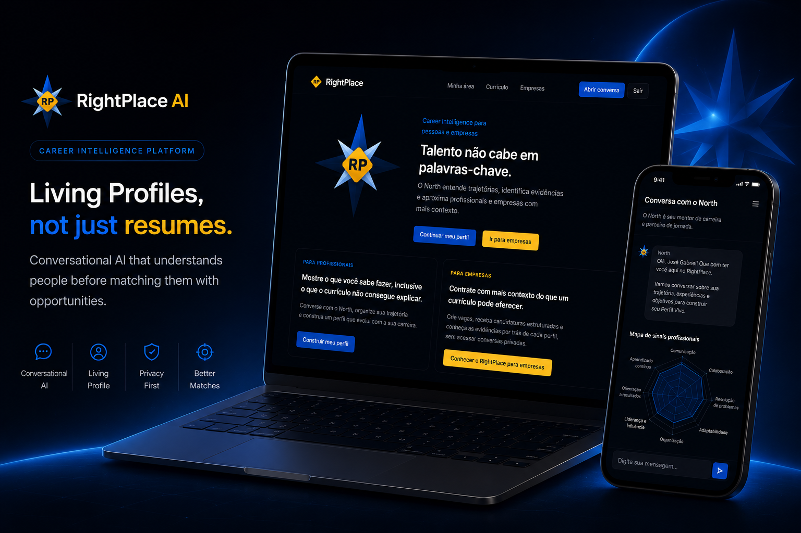

  

<h1 align="center">RightPlace AI</h1>

<strong>Career Intelligence Platform</strong> 
Understanding people before matching opportunities.

*A conversation-first approach to hiring, designed to understand people beyond resumes.*

---

# The Future of Hiring Starts Here

Recruitment has become faster than ever.

Modern Applicant Tracking Systems (ATS) can process thousands of resumes in minutes, automatically filtering candidates based on keywords, previous job titles, certifications and predefined requirements.

Efficiency improved.

Understanding did not.

RightPlace AI explores a different approach.

Instead of asking **"Does this resume match the job?"**, it starts by asking:

> **"Who is this professional?"**

Every conversation adds context.

Every interaction enriches a professional profile.

Every opportunity begins with understanding before evaluation.

---

# The Problem

> **Modern hiring became incredibly efficient.  
> Unfortunately, it also became increasingly superficial.**

Traditional recruitment platforms were designed around documents.

Candidates spend hours polishing resumes, while companies rely on increasingly sophisticated systems to process them automatically.

Although this workflow saves time, it often overlooks what cannot be summarized in one or two pages.

Things like:

- career transitions
- personal projects
- freelance work
- volunteer experience
- learning outside formal education
- transferable skills
- growth potential
- motivations and aspirations

As hiring becomes more automated, professionals risk being represented by keywords instead of their complete story.

RightPlace AI challenges this assumption.

---

# A Better Approach

> **Understanding should come before matching.**

  

  <em>
  Traditional recruitment evaluates resumes.
  RightPlace AI understands people.
  </em>

RightPlace AI replaces static forms with meaningful conversations.

Instead of asking candidates to continuously rewrite their professional story for every opportunity, the platform gradually builds a **Living Professional Profile** through conversational AI.

Rather than extracting isolated keywords, the platform identifies context.

Rather than ranking resumes, it understands trajectories.

Rather than focusing exclusively on previous positions, it considers potential, adaptability and professional goals.

This creates a richer foundation for better hiring decisions on both sides of the process.

The result is a platform where Artificial Intelligence supports human decisions instead of replacing them.

---

## Our Design Principles

### 👤 People First

People evolve.

Professional profiles should evolve too.

---

### 💬 Conversation Before Evaluation

Understanding always comes before matching.

---

### 🤖 AI as an Assistant

Artificial Intelligence organizes information.

People make decisions.

---

### 🔒 Privacy by Design

Trust isn't a feature.

It's part of the architecture.
---

# Meet North

> **Every meaningful career starts with a conversation.**

  

North is the conversational intelligence behind RightPlace AI.

But North was never designed to replace recruiters.

Nor to approve or reject candidates.

Instead, North has a much simpler mission:

> **Understand people before connecting them with opportunities.**

Every conversation is an opportunity to discover experiences that rarely appear on a resume.

Career transitions.

Personal projects.

Challenges.

Achievements.

Motivations.

Learning experiences.

Professional aspirations.

Rather than asking candidates to complete another long form, North guides them through a natural conversation, gradually transforming isolated information into meaningful professional context.

The result isn't another document.

It's a richer understanding of who that person is and where they want to go.

---

## More Than an AI Assistant

North was intentionally designed as a **career companion**, not an automated evaluator.

Its role is to help professionals reflect on their journey, organize experiences and build a profile that represents more than previous job titles.

Throughout every conversation, North continuously transforms information into structured knowledge without losing the human context behind it.

This conversational approach makes every interaction valuable—not only for a single application, but for the professional's entire career.

---

# Living Profiles

> **Careers evolve. Professional profiles should evolve too.**

  

Traditional resumes become outdated the moment they are exported as PDFs.

Living Profiles are different.

Instead of static documents, they continuously evolve through conversations, experiences and professional growth.

Every new interaction helps enrich the profile with additional context, new skills, updated goals and stronger evidence of professional capabilities.

Rather than asking candidates to repeatedly rewrite their story, RightPlace AI keeps building it over time.

A resume becomes a snapshot.

A Living Profile becomes an evolving professional identity.

---

## What Makes a Living Profile Different?

Instead of storing only professional history, Living Profiles connect multiple dimensions of a person's career.

They combine:

- Professional experience
- Technical skills
- Behavioral competencies
- Personal projects
- Career goals
- Learning journey
- Professional interests
- Conversation insights
- Verified evidence

Together, these elements create a richer representation of professional potential than a traditional resume alone could ever provide.

---

# Candidate Journey

> **One conversation. Endless opportunities.**

  

The candidate experience was designed to be simple, conversational and continuously evolving.

Instead of creating a new profile for every application, professionals build a single Living Profile that grows throughout their career.

The journey follows a natural progression:

1. Create an account.
2. Meet North.
3. Build a Living Profile through conversation.
4. Keep the profile evolving over time.
5. Apply to opportunities using a richer professional identity.

Each conversation strengthens future opportunities.

The profile becomes more complete with every interaction.

---

# Company Journey

> **Better context creates better hiring decisions.**

  

Companies don't receive longer resumes.

They receive better information.

Instead of relying exclusively on keyword matching, recruiters gain access to structured professional profiles enriched by conversational insights.

This allows hiring teams to understand not only what candidates have done, but also:

- how they learn
- what motivates them
- where they want to grow
- how their experiences connect
- why they may be a strong fit

The goal isn't to automate hiring.

The goal is to improve the quality of hiring decisions by providing richer professional context.

---

> **Next → Privacy by Design**

Every professional profile deserves transparency, security and complete user control.
