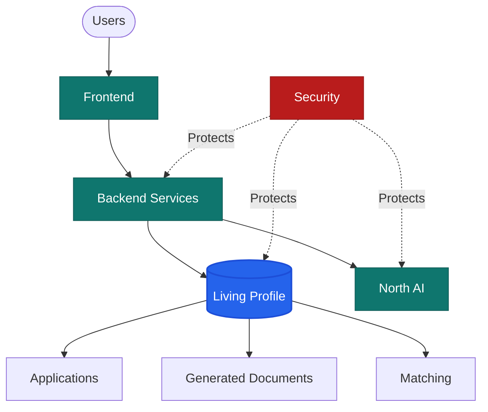
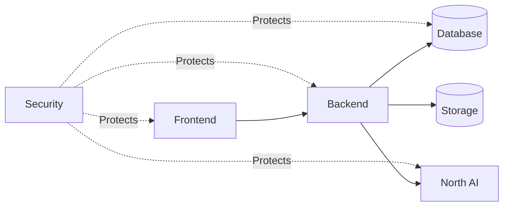
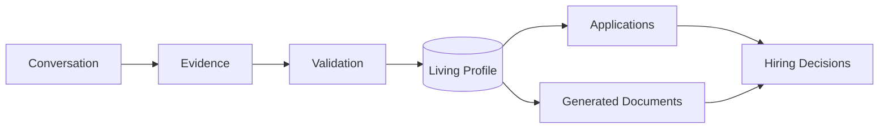

# 🏗️ Architecture

> RightPlace AI is designed around professional understanding rather than document management.
>
> Its architecture separates user experience, business orchestration, AI reasoning and persistent knowledge into independent but connected layers.

---

# Overview

RightPlace AI follows a layered architecture where every component has a well-defined responsibility.

Rather than allowing infrastructure decisions to shape the platform, the architecture is organized around product domains. Each layer can evolve independently while preserving clear boundaries, reducing coupling and improving long-term maintainability.

---

# Architecture Principles

The platform is built around a small set of architectural principles.

- Business logic belongs to the backend.
- Professional understanding is independent from AI models.
- The Living Profile is the single source of truth.
- Documents are generated artifacts, not stored knowledge.
- Security is enforced across every layer.
- Components communicate through well-defined boundaries.
- Infrastructure supports the architecture—not the other way around.

These principles guide every technical decision across the platform.

---

# 📚 Architecture Documents

<table>
<tr>

<td width="50%" valign="top">

### 🤖 AI Architecture

Conversational intelligence, reasoning pipeline and the Living Profile.

<a href="./AI.md">Read documentation →</a>

</td>

<td width="50%" valign="top">

### 🗄️ Database Architecture

Persistent data model, domain ownership and relationships.

<a href="./DATABASE.md">Read documentation →</a>

</td>

</tr>

<tr>

<td width="50%" valign="top">

### ⚙️ Backend Architecture

Business orchestration, service boundaries and AI coordination.

<a href="./BACKEND.md">Read documentation →</a>

</td>

<td width="50%" valign="top">

### 🖥️ Frontend Architecture

Application structure, user experience and interaction model.

<a href="./FRONTEND.md">Read documentation →</a>

</td>

</tr>

<tr>

<td width="50%" valign="top">

### 🔐 Security Architecture

Identity, authorization and platform trust boundaries.

<a href="./SECURITY.md">Read documentation →</a>

</td>

<td width="50%" valign="top">

### 🔄 Data Flow Architecture

Information lifecycle and communication between platform components.

<a href="./DATA_FLOW.md">Read documentation →</a>

</td>

</tr>

<tr>

<td width="50%" valign="top">

### 🚀 Deployment Architecture

Production topology, infrastructure and deployment strategy.

<a href="./DEPLOYMENT.md">Read documentation →</a>

</td>

<td width="50%" valign="top">

### 🏗️ Architecture Overview

The entry point to the platform architecture.

<strong>You are here.</strong>

</td>

</tr>
</table>

---

# System Architecture

Each document describes one architectural perspective while remaining connected to the others.

Together, these documents describe how information moves across the platform while preserving clear ownership and responsibilities.

---

# Layer Responsibilities

| Layer | Responsibility |
|--------|----------------|
| Frontend | User interaction and experience. |
| Backend | Business orchestration and policy enforcement. |
| AI | Evidence collection and professional reasoning. |
| Database | Persistent professional understanding. |
| Storage | Generated artifacts and assets. |
| Security | Identity, authorization and trust boundaries. |

No layer assumes responsibilities that belong to another.

---

# Information Lifecycle

Professional understanding evolves continuously as new evidence is collected and validated.

Unlike traditional recruitment platforms, documents are the result of accumulated professional understanding rather than the starting point.

---

# Technology

The current implementation uses a modern cloud-native stack.

| Area | Technology |
|------|------------|
| Frontend | Next.js, React, TypeScript |
| Backend | Firebase Cloud Functions |
| Database | Cloud Firestore |
| Authentication | Firebase Authentication |
| Storage | Cloud Storage |
| AI | Gemini Models |

These technologies may evolve over time without changing the architectural principles described in this documentation.

---

# Design Philosophy

RightPlace AI is not built around resumes.

It is built around people.

The platform captures professional evidence, transforms it into structured understanding and generates the artifacts required for each hiring context.

Technology enables this process.

Architecture protects it.

---

# Core Idea

Architecture is more than software structure.

It is the collection of decisions that allows the platform to evolve without losing its purpose.

Every document in this directory describes one aspect of that vision.

> Understand the professional.
>
> Protect the information.
>
> Generate the right opportunity.
